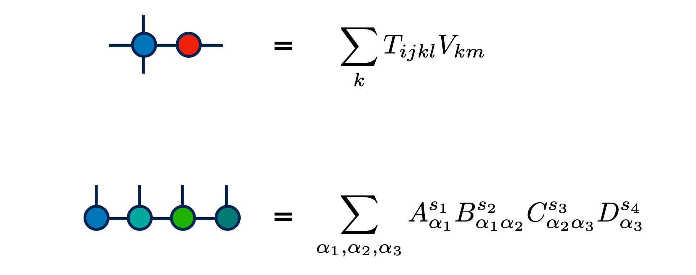
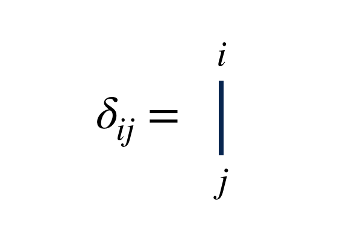

# Tensor Diagram Notation

Tensor diagram notation\cite{Penrose:1971} is a simple, yet powerful
graphical notation for networks of contracted tensors.

A tensor contraction of the form $\sum_j M_{ij} N_{jkl}$ can be notated 

Despite its graphical and intuitive nature, tensor diagram notation
is completely rigorous and well defined: it is just a graphical
notation for sums. It is inspired by
the Einstein summation convention for notating tensor contractions.

## Tensor Diagram Rules

There are two hard-and-fast rules of tensor diagrams:

1. Tensors are notated by solid shapes, and tensor indices
   are notated by lines emanating from these shapes.

2. Connecting two index lines implies a contraction, or summation
   over the connected indices.

Other conventions are often adopted by certain
authors or in specific contexts. For example, using shapes or 
shadings to designate properties of tensors;
orienting index lines according to certain conventions;
or putting arrows on lines to distinguish
contravariant and covariant indices.

Though it can be helpful to label indices and tensors
with letters, it is optional to do so when the same information
can be inferred from context. In fact, one of the main
benefits of diagram notation is that it frees one
from having to name every index in a complicated 
tensor network.

## Examples

Let us look at some example diagrams for familiar low-order tensors:

And some examples of matrix-like contractions:

As well as tensor contractions:

In the first example above, the names of the indices are
notated on the diagram. But the other examples emphasize that this
is optional. (Technically the second example is ambiguous about
which index is $i$ and which is $k$, but in practice this ambiguity
is rarely a problem, or when it is, the labels can be notated.)

## Identity Matrices

Because contracting a tensor over one of its indices with the
identity matrix has no effect, it is customary to notate 
identity matrices just as plain lines with no "blob" or "shape"
as with other tensors. Diagrammatically, this looks like:

This notation is useful, because the diagram for contracting with
an identity matrix just extends an index line i.e. has no effect
on the tensor:

## Advantages of Tensor Diagram Notation

Tensor diagram notation has many benefits compared to other notations:

- Various operations, such as a trace, tensor product, or tensor contraction
  can be expressed simply without extra notation.

  * Placing tensors next to each other denotes a tensor/outer product.
  * Connecting two index lines of the same tensor corresponds to a trace.
  * Connecting index lines of different tensors denotes a tensor contraction.

- Names of indices and tensors can often be omitted. This saves
  time and lightens the notation, and is 
  especially useful for internal indices which exist 
  mainly to be summed over.

- The order of the tensor resulting from a complicated network of 
  contractions can be determined by inspection: it is just the number of
  unpaired lines. For example, a tensor network with all lines joined, no
  matter how complicated, must result in a scalar.

## Other Resources

The diagram notation used in the tensor network literature is relatively 
informal and has quite a range of variation, but more formal
specifications have been [proposed](https://en.wikipedia.org/wiki/Penrose_graphical_notation).

A helpful introduction to diagram notation as it is used in quantum physics is
given by Bridgeman and Chubb.\cite{Bridgeman:2017}

<!-- TODO:
* Give pictorial examples of operations from math/stats tensor literature 
  drawn as tensor diagrams:
  - n-mode product $\times_n$ (contraction of a matrix with one of the indices)
  - matricization (just grouping indices)
  - tracing index pairs
  - tensor/outer product (just placing tensors next to each other)
  
-->

