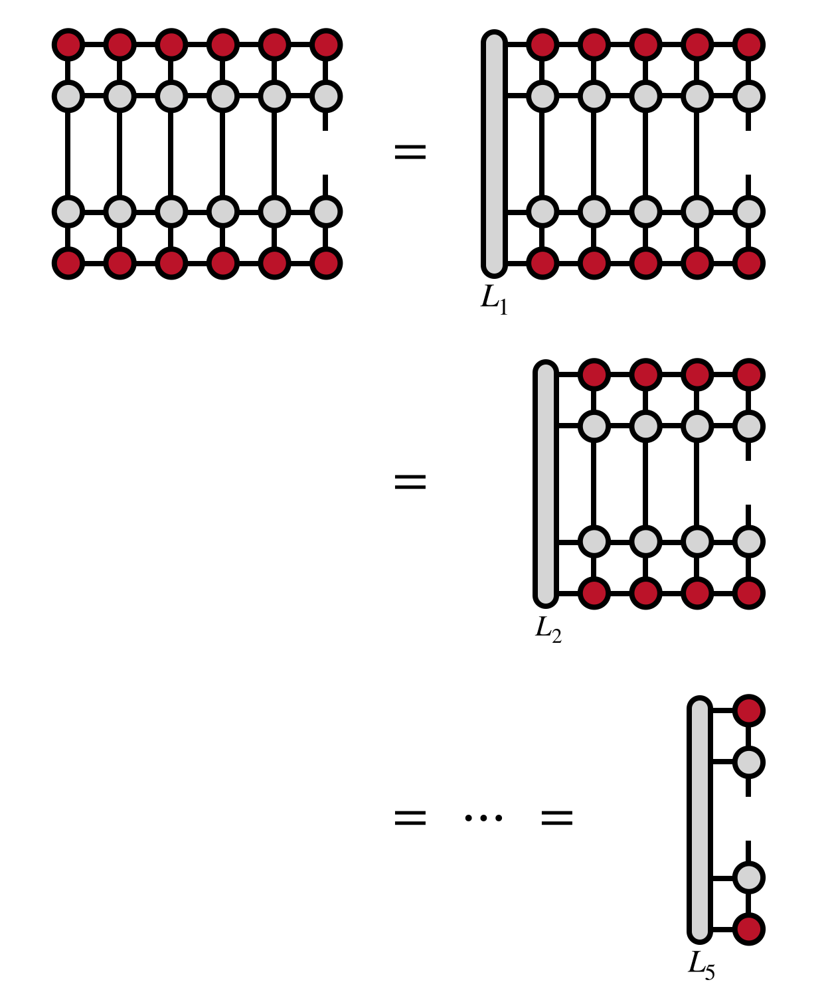

# MPO-MPS Multiplication: Density Matrix Algorithm

One way to multiply a [[matrix product state (MPS)|mps]] 
(or *tensor train*) tensor network
by a [[matrix product operator (MPO)|mpo]] is to 
use the product of these two networks as input to
the [[density matrix MPS compression algorithm|mps/index#compression]].

The page will describe the algorithm in detail, but it may be
helpful to first review the [[simpler case of the algorithm|mps/index#compression]]
that only involves compressing an MPS to a smaller MPS.

## Statement of the Problem

Given an MPS of bond dimension $M$ and an MPO of bond dimension $k$,
we wish to represent their product as another MPS of bond dimension $m$.
That is, we wish to find the MPS on the right-hand side of the following
equation:

such that the Euclidean distance between the two sides of the equation
are minimized subject to the constraint on the dimensions of the 
constituent tensors.

## Steps of the Algorithm

The algorithm uses the fact that the MPS representation of a large
tensor can be computed by singular value decompositions of the 
tensor over bipartitions of its indices. Just as the singular value
of a matrix $M$ can be computed by diagonalizing $M^\dagger M$ 
and $M M^\dagger$, so an MPS can be computed by squaring a tensor,
summing over different subsets of its indices. These squarings
of the tensor we wish to compress are the density matrices,
and the tensor we are compressing is the product of the MPS 
times the MPO.

### Step 1: Compute Partial Traces

To begin the algorithm, one computes the following partial trace
of the square of the MPO-MPS product:

To make it easier to visualize the contractions, it is helpful
to redraw the network to be computed as follows:

Now, one begins computing the network from the left, saving
the $L_j$ tensors indicated in the figure below to be used
in later steps of the algorithm:

### Step 2: Diagonalize Density Matrices

### Step 3: Compute the First MPS Tensor

## Acknowledgements

The idea for the algorithm came from discussions with Glen Evenbly,
Steven R. White, and Ian McCulloch.

