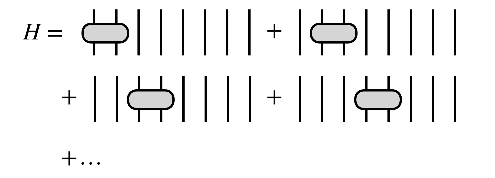
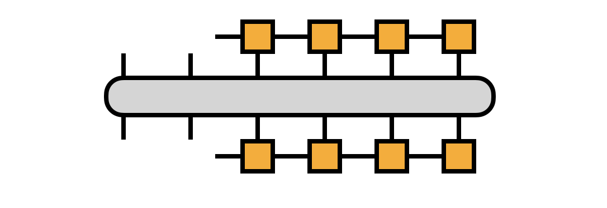
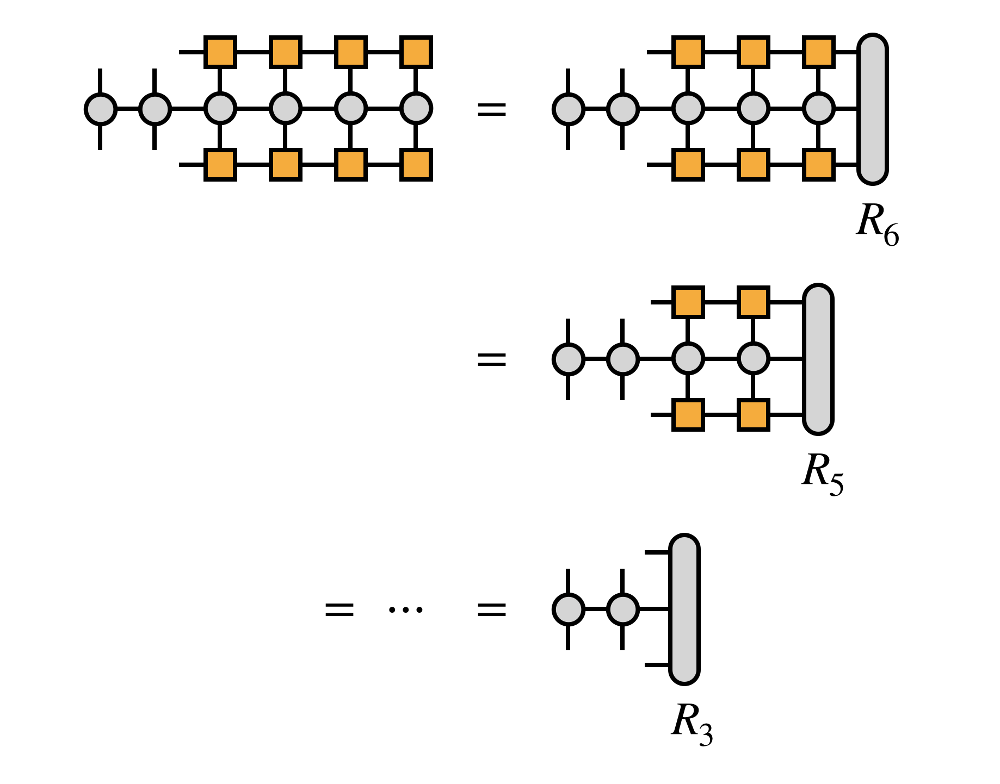
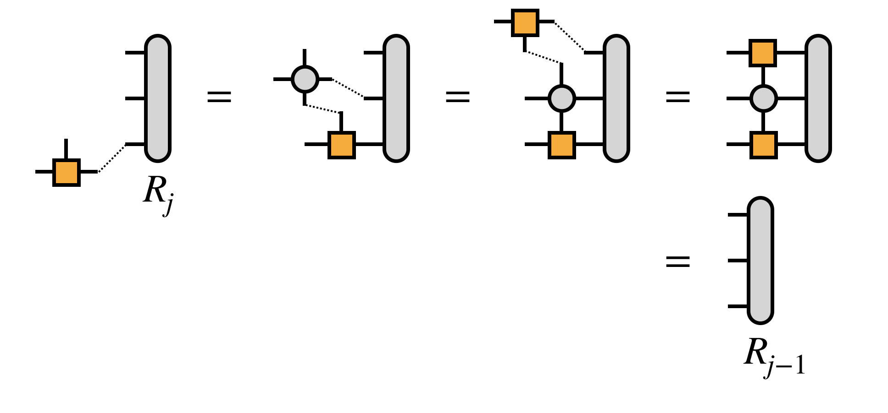

# Density Matrix Renormalization Group Algorithm (DMRG)

<!--TOC-->

The density matrix renormalization group (DMRG)\cite{White:1992,White:1993den,Schollwoeck:2005}
is an adaptive algorithm for optimizing a [[matrix product state (MPS)|mps]] (or tensor train) 
tensor network, such that after optimization, the MPS is approximately the dominant 
eigenvector of a large matrix $H$.
The matrix $H$ is usually assumed to be a Hermitian matrix, but the 
algorithm can also be formulated for more general matrices.

The DMRG algorithm works by optimizing two neighboring MPS tensors at a time, temporarily 
combining them into a single tensor to be optimized. The optimization is performed using 
an iterative eigensolver approach such as Lanczos or Davidson. Before the next step, the single tensor is
factorized using an [[SVD|svd]] or density matrix decomposition in order to restore the MPS form.
During this factorization, the bond dimension (or tensor train rank) of the MPS can be
adapted. This adaptation is optimal in the sense of preserving the distance between the 
network just after the optimization step and the network with restored MPS form.

In physics and chemistry applications, DMRG is mainly used to find ground states of Hamiltonians of many-body
quantum systems. It has also been extended to compute excited states, and to simulate
dynamical, finite-temperature, and non-equilibrium systems. 

Algorithms similar to or inspired by DMRG have been developed for more general MPS computations, such
as summing two MPS; multiplying MPS by MPO networks; or finding MPS solutions to linear systems.

## Statement of the Problem

Consider a Hermitian matrix $H$ acting in vector space that is the tensor product of $N$ smaller
spaces, each of dimension $d$:

The DMRG algorithm seeks the dominant eigenvector of $H$ in the form of an MPS tensor network 

Here $E_0$  $(\leq E_1 \leq E_2 \ldots)$ is the minimum eigenvalue of $H$.
(See below for a discussion of what the DMRG algorithm does when $H$ has more
than one minimum eigenvalue.)

For the algorithm to be efficient, $H$ must have certain simplifying properties.
For example $H$ could be a sum of local terms

or, more generally, $H$ could be given as an [[MPO|mpo]] tensor network

The MPO form is the most natural one for the DMRG algorithm, and can efficiently
represent many cases one wants to consider, such as when $H$ is a sum of local
terms.

However, other simplifying forms of $H$ can also permit efficient formulations of the DMRG
algorithm, such as if $H$ is a sum of MPO tensor networks or outer products of MPS
tensor networks.

## Steps of the DMRG Algorithm

### Step 0: Setup

Before beginning the DMRG algorithm, it is imperative to bring the initial MPS into an orthogonal form via a [[gauge transformation|mps#toc_7]]. Here we will choose to begin the DMRG algorithm assuming (without loss of generality) that the MPS tensors 2,3,...,N are all right-orthogonal:

Because of the right-orthogonality property, we can interpret the MPS tensors numbers
$3,4,5,\ldots$ collectively as a change of basis from the basis of visible indices
$i_3,i_4,i_5,\ldots$ to the bond index $\alpha_2$ as follows:

This interpretation motivates transforming the matrix $H$ into the $i_1,i_2,\alpha_2$
basis as given by the following diagram:

If we take $H$ to be in [[MPO|mpo]] form, we can compute the transformation efficiently,
defining the $E_j$ "edge" tensors along the way:

For efficiency, it is crucial that the edge tensors be created by contracting 
each MPS or MPO tensor one at a time in a certain order, as follows:

Next, combine the first two MPS tensors by contracting over their shared bond index:

At the point, it is helpful to observe that the components of the resulting "bond tensor" $B^{i_1 i_2 \alpha}_{12}$ are not just partial information about the tensor $v$ represented by the MPS. Rather, they are the coefficients of $v$ in the $i_1, i_2, \alpha_2$ basis. If the $\alpha_2$ basis spans a subspace of the $i_3, i_4, \ldots, i_N$ space sufficient to represent the eigenvector of $H$ we seek, then optimizing $B_{12}$ to be the dominant eigenvector of the transformed $H$ is sufficient to solve the original problem.

In practice, however the $\alpha_2$ basis can be improved, and to do so the algorithm optimizes $v$ at every bond sequentially.

### Step 1: Optimization

To optimize the first bond tensor $B_{12}$, a range of procedures can be used, but often the most effective are iterative algorithms, either Davidson\cite{Davidson:1976} or Lanczos. 

The key step of each of these algorithms is the multiplication of $B_{12}$ by the (transformed) matrix $H$:

<!--
## Convergence Properties

- Exponential convergence in sweeps when H is 1D, local, gapped / finite correlation length
- Not guaranteed to converge to dominant eigenvector: "sticking problem"
- Discuss case of degenerate minimum eigenvalues (MES hypothesis)
-->

<!--
## DMRG for Tree Tensor Networks

The DMRG algorithm can be extended straightforwardly to arbitrary [[tree tensor networks|ttn]], of 
which MPS are a special case. Instead of sweeping forward and backward along an MPS chain, the
algorithm visits each bond of a tree, otherwise performing very similar optimization and factorization
steps. 

An important optimization compared to the MPS case, however, is that instead of merging adjacent
tree tensors by simply contracting their shared bond index, one first factorizes each factor tensor
into a tensor carrying the external index and a remainder, then merges the tensors carrying 
the external indices as shown below

After optimizing the merged tensor, it is factorized using an SVD and the tree tensor network
form restored:

-->

<!--
## Connections to Other Algorithms

- An algorithm with similar steps as DMRG has been developed for (Discuss Rolfe EM algorithm)
-->

