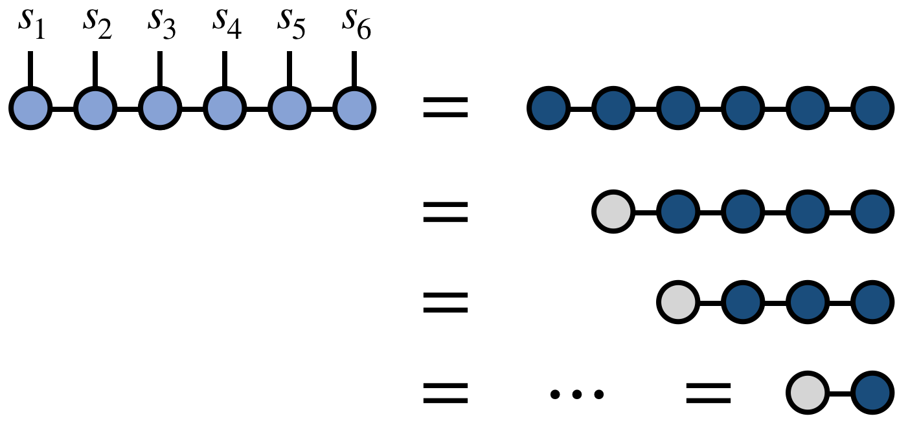
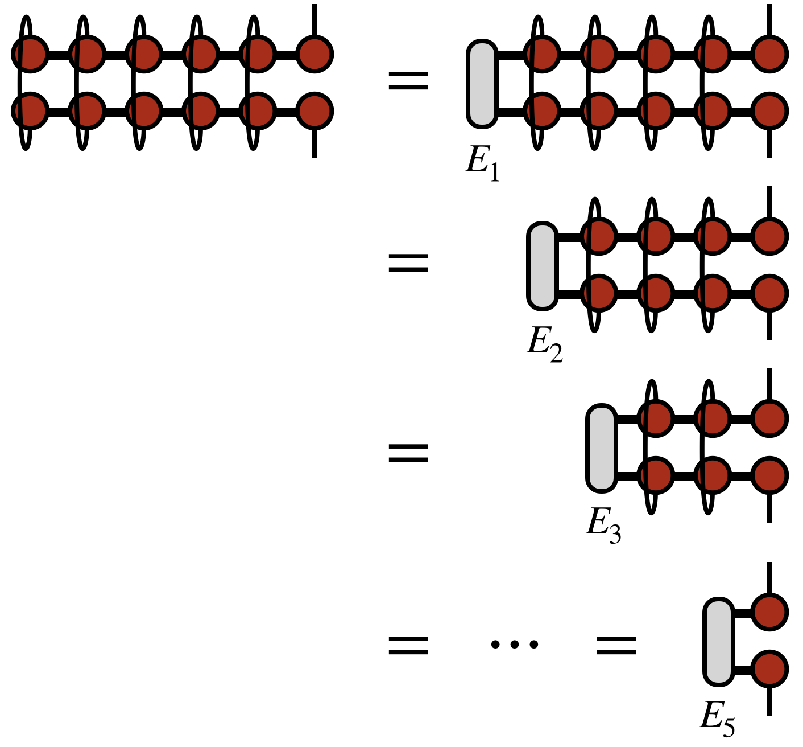
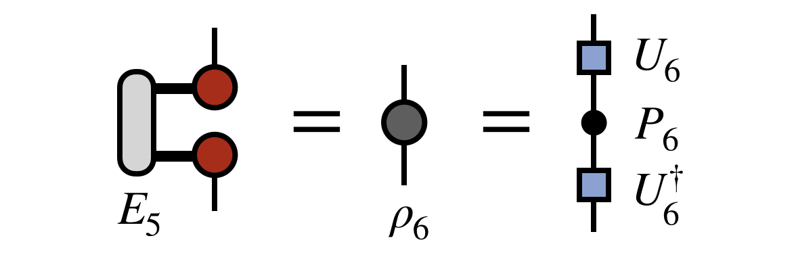

# Matrix Product State / Tensor Train

The matrix product state (MPS)\cite{Fannes:1992,Klumper:1992,Ostlund:1995} or tensor train (TT)\cite{Oseledets:2011} tensor network
is a factorization of a [[tensor|tensor]] with N indices
into a chain-like product of three-index tensors.
The MPS/TT is one of the best understood tensor networks for which
many efficient algorithms have been developed, in part because
because it is a special case of a [[tree tensor network|ttn]]. 

A matrix product state / tensor train factorization of a tensor $T$ 
can be expressed in [[tensor diagram notation|diagrams]] as

where for concreteness $T$ is taken to have six indices, but the 
pattern above can be generalized for a tensor with any number of indices.

Alternatively, the MPS/TT factorization of a tensor
can be expressed in traditional notation as

\begin{equation}
T^{s_1 s_2 s_3 s_4 s_5 s_6} = \sum_{\{\mathbf{\alpha}\}} A^{s_1}_{\alpha_1} 
A^{s_2}_{\alpha_1 \alpha_2}
A^{s_3}_{\alpha_2 \alpha_3} 
A^{s_4}_{\alpha_3 \alpha_4} 
A^{s_5}_{\alpha_4 \alpha_5} 
A^{s_6}_{\alpha_5}
\end{equation}

where the bond indices $\alpha$ are contracted, or summed over.
Note that each of the $A$ tensors can in general be different
from each other; instead of denoting them with different letters,
it is a useful convention to just distinguish them by their indices.

Any tensor can be exactly represented in MPS / TT form for a large
enough dimension of the bond indices $\alpha$. \cite{Vidal:2003,Oseledets:2011}

## Bond Dimension / Rank

A key concept in understanding the matrix product state or tensor train 
factorization is the _bond dimension_ or _tensor-train rank_, sometimes
also called the virtual dimension. This is the dimension of the bond 
index connecting one tensor in the chain to the next, and can vary
from bond to bond. The bond dimension can be thought of as a 
parameter controlling the expressivity of a MPS/TT network. 
In the example above, it is the dimension of the $\alpha$ indices.

Given a large enough bond dimension or rank, an MPS/TT can
represent an arbitrary tensor. Consider a tensor
$T^{s_1 s_2 \cdots s_N}$ having N indices all of dimension $d$.
Then this tensor can always be represented exactly as an MPS/TT with
bond dimension $m=d^{N/2}$.

However, in most applications the MPS/TT form is used as an approximation.
In such cases, the bond dimension or rank is either fixed at a moderate size,
or determined adaptively.

## Number of Parameters

Consider a tensor with $N$ indices, each of dimension $d$. Generically,
such a tensor must be specified by $d^N$ parameters.
In contrast, representing such a tensor by an MPS/TT network of bond dimension $m$
requires

\begin{equation}
N m^2 d
\end{equation}

parameters at most.

If the MPS/TT representation of the tensor is a good approximation, then
it represents a massive compression from a set of parameters growing
exponentially with $N$, to a set of parameters growing just linearly with $N$.

It is possible to reduce the number of parameters even further, without
loss of expressive power, by exploiting the redundancy inherit in the MPS/TT network. 
For more information about this redundancy, see the section on MPS/TT gauges
below.

For a tensor with an infinite number of indices, the MPS/TT parameters can 
be made independent of $N$ by assuming that all of the factor tensors are the same
(or the same up to a gauge transformation).;

## Elementary Operations Involving MPS/TT

<!--
Other algorithms to add:
- retrieving a component of an MPS/TT
- compressing/rounding to a smaller bond dimension
-->

The MPS/TT tensor network format makes it possible to efficiently
carry out operations on a large, high-order tensor $T$ by manipulating
the much smaller factors making up the MPS/TT representation of $T$.

There are many known algorithms for computations involving MPS/TT networks.
Below, we highlight some of the simplest and most fundamental examples.

### Retrieving a Component from an MPS/TT  

Consider an order-$N$ tensor $T$. In general, cost of storing and retrieving 
its components scales exponentially with $N$. However, if $T$ can be 
represented or approximated by an MPS/TT network, one can obtain
specific tensor components with an efficient algorithm.

Say we want to obtain the specific component $T^{s_1 s_2 s_3 \cdots s_N}$,
where the values $s_1, s_2, s_3, \ldots, s_N$ should be considered fixed,
yet arbitrary.

If $T$ is given by the MPS/TT
\begin{equation}
T^{s_1 s_2 s_3 \cdots s_N} = \sum_{\{\mathbf{\alpha}\}} 
A^{s_1}_{\alpha_1} 
A^{s_2}_{\alpha_1 \alpha_2}
A^{s_3}_{\alpha_2 \alpha_3} 
\cdots
A^{s_N}_{\alpha_{N-1}}
\end{equation}
then the algorithm to retrieve this component is very simple. Fix the
$s_j$ indices on each of the $A$ factor tensors. Then, thinking of the
tensor $A^{(s_1)}_{\alpha_1}$ as a row vector and $A^{(s_2)}_{\alpha_1 \alpha_2}$
as a matrix, contract these over the $\alpha_1$ index. The result is a new 
vector $L_{\alpha_2}$ that one can next contract with $A^{(s_3)}_{\alpha_2 \alpha_3}$.
Continuing in this manner, one obtains the $s_1,s_2,s_3,\ldots,s_N$ component
via a sequence of vector-matrix multiplications.

Diagramatically, the algorithm for retrieving a tensor component can be written as
(for the illustrative case of $N=6$):

If the typical bond dimension of the MPS/TT is $m$, then the computational cost
for retrieving a single tensor component scales as $N m^2$.

In the physics literature, the name _matrix product state_ refers to the 
fact that an individual tensor component (in the context of a quantum state or 
wavefunction) is parameterized as a product of matrices as in the algorithm above.
(This name is even clearer in the case of [[periodic MPS|periodicMPS]].)

### Inner Product of Two MPS/TT \cite{Perez-Garcia:2007}

Consider two high-order tensors $T^{s_1 s_2 s_3 s_4 s_5 s_6}$ 
and $W^{s_1 s_2 s_3 s_4 s_5 s_6}$. Say that we want to compute the inner product of 
$T$ and $W$, viewed as vectors. That is, we want to compute:

\begin{equation}
\langle T, W\rangle =
\sum_{\{\mathbf{s}\}} 
T^{s_1 s_2 s_3 s_4 s_5 s_6} 
W^{s_1 s_2 s_3 s_4 s_5 s_6} 
\end{equation}

In the case of $T = W$, then this operation computes the Frobenius norm of $T$.

Now assume that $T$ and $W$ each can be efficiently represented or approximated by 
MPS/TT tensor networks as follows:

\begin{equation}
T^{s_1 s_2 s_3 s_4 s_5 s_6} = \sum_{\{\mathbf{\alpha}\}} 
A^{s_1}_{\alpha_1} 
A^{s_2}_{\alpha_1 \alpha_2}
A^{s_3}_{\alpha_2 \alpha_3} 
A^{s_4}_{\alpha_3 \alpha_4} 
A^{s_5}_{\alpha_4 \alpha_5} 
A^{s_6}_{\alpha_5}
\end{equation}

\begin{equation}
W^{s_1 s_2 s_3 s_4 s_5 s_6} = \sum_{\{\mathbf{\beta}\}} 
B^{s_1}_{\beta_1} 
B^{s_2}_{\beta_1 \beta_2}
B^{s_3}_{\beta_2 \beta_3} 
B^{s_4}_{\beta_3 \beta_4} 
B^{s_5}_{\beta_4 \beta_5} 
B^{s_6}_{\beta_5}
\end{equation}

The strategy to efficiently compute $\iprod{T}{W}$ is to contract $A^{s_1}$ with 
$B^{s_1}$ over the $s_1$ index, forming a tensor $E^{\alpha_1}_{\beta_1}$. 
Then this tensor $E$ is contracted with $A^{s_2}$ and $B^{s_2}$ to form 
another intermediate tensor $E^{\alpha_2}_{\beta_2}$, etc. 

Let us express this process more simply in diagrammatic notation:

The above algorithm makes no approximations, yet is very efficient.
A careful analysis of each step shows that the cost of the algorithm scales as

\begin{equation}
N m^3\,d
\end{equation}

where $m$ is the bond dimension or rank of the MPS/TT networks and $d$ is the dimension
of the external indices. In contrast, if one worked with the full $T$ 
and $W$ tensors and did not use the MPS/TT form the cost of
calculating $\iprod{T}{W}$ would be $d^N$.

### Compression / Rounding \cite{McCulloch:2007,Oseledets:2011}

A particularly powerful operation is the compression of a tensor network into 
MPS/TT form. Here we will focus on the compression of a larger bond dimension MPS/TT
into one with a smaller dimension, but the algorithm can be readily generalized 
to other inputs, such as sums of MPS/TT networks, sums of rank-1 tensors, 
other [[tree tensor network|ttn]] formats, and more, with the result that these
inputs are controllably approximated by a single MPS/TT.

The algorithm we follow here was proposed in Ref. \onlinecite{McCulloch:2007}
and based on the original [[DMRG|DMRG]] concept of White.\cite{White:1992}
However, other approaches to compression include SVD-based 
compression,\cite{Schollwoeck:2011} such as the TT-SVD algorithm,\cite{Oseledets:2011}
or variational compression.\cite{Perez-Garcia:2007}

For concreteness, say we want to compress an MPS/TT of bond dimension $M$ into
one of bond dimension $m$, such that the new MPS/TT is as close as possible to 
the original one, in the sense of Euclidean distance (see above discussion of inner product).

The compression procedure begins with contracting two copies of the input MPS/TT network over all of the external indices, except the last external index. The intuition here is that the MPS/TT form is generated by a repeated SVD of a tensor. Just as an SVD of a matrix $M$ can be computed by diagonalizing $M^\dagger M$ and $M M^\dagger$, the MPS/TT here appears twice for the same reason.

To compute the contraction of the two MPS/TT copies efficiently, one forms the intermediate tensors labeled $E_1$, $E_2$, etc. below. These tensors are assumed to be saved for use in later steps of the algorithm as we will see.

Having computed all of the $E_j$ tensors, it is now possible to form the object $\rho_6$ below, which in physics is called a _reduced density matrix_, but more simply is the square of the tensor represented by the network, summed over all but its last index:

To begin forming the new, compressed MPS/TT, one diagonalizes $\rho_6$ as shown in the last expression above. It is a manifestly Hermitian matrix, so it can always be diagonalized by a unitary $U_6$, which is the box-shaped matrix in the last diagram above.

